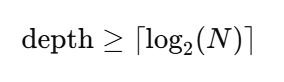

# ZK7702WalletMVP

Minimal wallet prototype using ZK + EIP-7702.

## Setup
1. `npm install hardhat ethers snarkjs circomlibjs`
2. `npx hardhat init`
3. `npx hardhat compile`
4. `npx hardhat node`

## Workflow
1. `npx hardhat run scripts/deployValidator.js --network sepolia`
2. `node scripts/generateProof.js <leaf>`
3. Open `frontend/index.html` in browser
4. Enter leaf value, click Submit to send EIP-7702 tx

## ZK
https://github.com/iden3/circomlib/tree/master
https://github.com/iden3/circomlibjs/tree/main
# build circom
1. `circom circuits/isWhitelisted.circom --r1cs --wasm --sym -o build`
2. `circom circuits/incrementalMerkleTree.circom --r1cs --wasm --sym -o build -l circuits`
# build witness
3. `node build/isWhitelisted_js/generate_witness.js build/isWhitelisted_js/isWhitelisted.wasm input.json build/witness_proof.wtns`
4. `node build/incrementalMerkleTree_js/generate_witness.js build/incrementalMerkleTree_js/incrementalMerkleTree.wasm input.json build/witness_tree.wtns`

## Snark
# setup zkey
1. `npx snarkjs powersoftau new bn128 20 pot_0000.ptau -v`
2. `npx snarkjs powersoftau contribute pot_0000.ptau pot_0001.ptau --name="我來貢獻" -v`
3. `npx snarkjs powersoftau prepare phase2 pot_0001.ptau pot_final.ptau `
4. `npx snarkjs groth16 setup build/isWhitelisted.r1cs pot_final.ptau isWhitelisted_0000.zkey`
5. `npx snarkjs zkey contribute isWhitelisted_0000.zkey isWhitelisted.zkey --name="Ethan" -v`
# prove creat proof.json
Merkle Tree 
20	depth = 5
32	depth = 5
33 ~ 64	depth = 6
6. `npx snarkjs groth16 prove isWhitelisted.zkey build/witness_proof.wtns proof.json public.json`
7. `npx snarkjs zkey export verificationkey isWhitelisted.zkey isWhitelisted.vkey.json`
8. `npx snarkjs groth16 verify isWhitelisted.vkey.json public.json proof.json`
9. `npx snarkjs zkey export solidityverifier isWhitelisted.zkey verifier.sol`